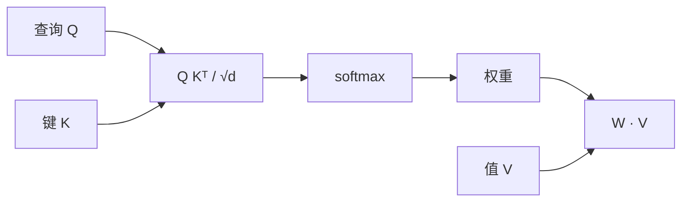

---
title: "注意力机制"
description: "缩放点积注意力、softmax 瓶颈视角，以及为什么注意力是可微的键值查找。"
category: "AI"
subcategory: "NLP"
tags:
  - NLP
  - 注意力
  - 深度学习
difficulty: "advanced"
created: 2025-06-14
updated: 2026-01-18
---

# 注意力机制

注意力是一种可微的内容寻址查找。它让模型按*相关性*而非按位置从一组向量中
读取信息——这一思想成就了 [[Transformer 架构]]，进而成就了现代 NLP。

## 缩放点积注意力

给定查询 $Q$、键 $K$、值 $V \in \mathbb{R}^{n \times d}$：

$$
\mathrm{Attention}(Q, K, V) = \mathrm{softmax}\!\Big(\frac{QK^\top}{\sqrt{d_k}}\Big) V
$$

```python
import torch
import torch.nn.functional as F

def attention(Q, K, V, mask=None):
    d_k = Q.size(-1)
    scores = Q @ K.transpose(-2, -1) / (d_k ** 0.5)
    if mask is not None:
        scores = scores.masked_fill(mask == 0, float('-inf'))
    return F.softmax(scores, dim=-1) @ V
```



## 为什么要除以 $\sqrt{d_k}$？

对随机单位向量，点积的方差为 $d_k$；缩放后 $\mathrm{Var}(QK^\top / \sqrt{d_k}) = 1$。
没有缩放时，大的 $d_k$ 会把 softmax 推进饱和区，梯度随之消失——模型无法学习。

## 几种解读

- **键值查找**：查询提问，键是地址，值是内容；注意力返回按查询–键一致性
  加权的值的软混合。
- **成对交互的集合**：注意力是 Transformer 中词元之间唯一发生交互的地方——
  其余一切都是逐位置计算。

> [!NOTE]
> 注意力对序列长度是 $O(n^2)$ 的。长序列场景下文献提出了稀疏、线性与核
> 近似——但缩放点积注意力仍是衡量其他一切方案的参考实现。

计算 $QK^\top$ 的复杂度为 $O(n^2 d_k)$ 时间、$O(n^2)$ 内存——这正是
[[Transformer 架构]] 围绕其设计结构的瓶颈所在。
