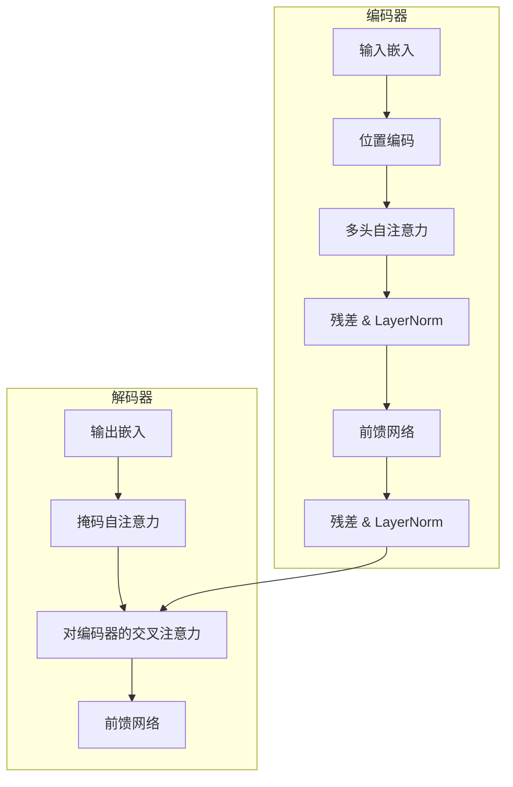

# Transformer 架构

Transformer（Vaswani 等，2017）用纯 [[注意力机制]] 加上逐位置前馈网络取代了
循环结构。其设计——可并行、深度高效、除显式编码外对序列顺序不敏感——
成为了现代 AI 的基石。

## 架构

每个块都是残差结构：$\mathrm{LayerNorm}(x + \mathrm{Sublayer}(x))$。残差流
是信息——以及梯度——流经整个网络的高速公路。

## 多头注意力

不是只做一次注意力，而是并行跑 $h$ 个并拼接：

$$
\mathrm{MultiHead}(Q,K,V) = \mathrm{Concat}(\mathrm{head}_1, \dots, \mathrm{head}_h) W^O
$$

每个头学到不同的注意力模式（句法、共指、局部窗口……）。投影矩阵
$W_i^Q, W_i^K, W_i^V, W^O$ 是需要学习的参数。

## 位置编码

注意力对置换等变：没有帮助时它无法区分「A B」与「B A」。原论文加入了不同
频率的正弦波：

$$
PE_{(pos, 2i)} = \sin(pos / 10000^{2i/d}), \qquad
PE_{(pos, 2i+1)} = \cos(pos / 10000^{2i/d})
$$

现代实现（RoPE、ALiBi、可学习位置编码）在此基础上改进，但需求完全一致：
显式注入顺序信息。

## 它为什么赢了

| 性质 | RNN | Transformer |
| --- | --- | --- |
| 并行性 | 串行（差） | 完全并行（好） |
| 长程路径 | $O(n)$ | $O(1)$ |
| 训练稳定性 | 梯度消失 | 残差 + LayerNorm |
| 计算量 | $O(n \cdot d^2)$ | $O(n^2 d)$ |

> [!IMPORTANT]
> 任意两个位置之间 $O(1)$ 的路径长度是关键算法洞见：梯度不再需要逐步穿越
> 整个序列。代价是 [[注意力机制]] 的 $O(n^2)$ 注意力代价。

把这个架构放大，就是 [[大语言模型]] 的故事。
