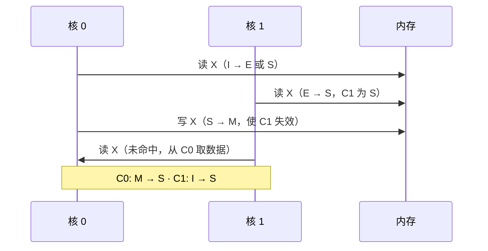

---
title: "缓存一致性协议"
description: "多核机器如何保持缓存一致：失效与更新、MSI/MESI 状态、目录与侦听。"
category: "计算机科学"
subcategory: "系统"
tags:
  - 系统
  - 体系结构
  - 并行
difficulty: "advanced"
created: 2025-12-01
updated: 2025-12-15
---

# 缓存一致性协议

每个核都有私有缓存，于是同一内存位置可能同时被缓存多处。**一致性协议**
负责让这些副本保持一致。这篇笔记只是草图——会随着我深入细节而不断生长。

## 一致性不变量

对单个内存位置而言，一致性要求：

1. **单一写者**——同一时刻至多一个核可以写入。
2. **新鲜的读**——一次写完成后，随后的读看到新值。
3. **写串行化**——对一个位置的写以单一顺序呈现给所有核。

> [!NOTE]
> 一致性关乎*单位置*的顺序；而强得多的**内存一致性模型**关乎*不同位置*
> 访问之间的顺序。两者极易混淆，值得分开对待。

## MSI/MESI 状态

每条缓存行携带一个状态。MESI（x86 的基线方案）：

| 状态 | 含义 |
| --- | --- |
| **M**odified | 脏，独占 |
| **E**xclusive | 干净，独占 |
| **S**hared | 干净，可能存在于其他缓存 |
| **I**nvalid | 不可用 |

## 侦听与目录

- **侦听（snooping）**：所有核监视共享总线上的失效消息。实现简单，但总线
  成为瓶颈——适合小规模核数。
- **目录（directory）**：由家节点为每行维护共享者列表。可扩展到大规模
  众核机器，代价是目录存储与间接访问。

> [!WARNING]
> 伪共享——两个核写入*不同*的字但位于*同一条*缓存行——即使没有逻辑数据竞争，
> 也会让协议来回失效（乒乓效应）。在性能敏感代码中把字段填充到缓存行边界
> 是标准修复手段。

这一块目前与 [[图算法]] 只在阅读清单上相连；现在悬而未决的问题主要是
[[内存一致性模型]]（未完成），以及 vLLM 风格的推理内核在 NUMA 下的行为。
