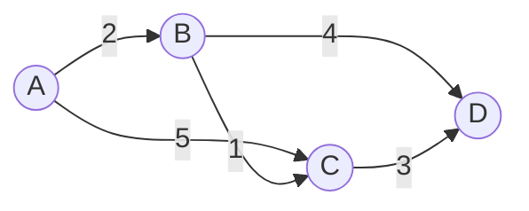

---
title: "图算法"
description: "遍历、最短路与最小生成树——核心图算法及其适用场景。"
category: "计算机科学"
subcategory: "算法"
tags:
  - 算法
  - 图论
  - 最短路
difficulty: "intermediate"
created: 2025-08-19
updated: 2025-12-22
---

# 图算法

图 $G = (V, E)$ 是计算机科学中最灵活的建模工具。这篇笔记覆盖算法核心：
遍历、最短路与生成树。

## 遍历

BFS 与 DFS 都是 $O(V + E)$ 时间；区别在于*顺序*，而顺序决定了沿途能算出什么。

| 算法 | 数据结构 | 典型用途 |
| --- | --- | --- |
| BFS | 队列 | 无权最短路、二分性判定 |
| DFS | 栈（递归） | 拓扑排序、连通分量、环检测 |
| 拓扑排序 | DFS 完成时间 | DAG 上的依赖顺序 |

## 最短路

```python
import heapq

def dijkstra(adj, source):
    """非负权重的 Dijkstra。O((V+E) log V)。"""
    dist = {source: 0}
    pq = [(0, source)]
    while pq:
        d, u = heapq.heappop(pq)
        if d > dist.get(u, float('inf')):
            continue
        for v, w in adj[u]:
            nd = d + w
            if nd < dist.get(v, float('inf')):
                dist[v] = nd
                heapq.heappush(pq, (nd, v))
    return dist
```

| 算法 | 权重 | 复杂度 | 备注 |
| --- | --- | --- | --- |
| BFS | 单位 | $O(V+E)$ | — |
| Dijkstra | $\ge 0$ | $O((V+E)\log V)$ | 有负边时失效 |
| Bellman–Ford | 任意 | $O(VE)$ | 可检测负环 |
| Floyd–Warshall | 任意 | $O(V^3)$ | 全源，稠密图 |



DAG 上的最短路退化为按拓扑序进行的 [[动态规划]]——递推式
$\text{dist}(v) = \min_{u \to v}(\text{dist}(u) + w(u,v))$ 恰好就是一个 DP。

## 最小生成树

- **Kruskal**：按边权排序 + 并查集，$O(E \log E)$——适合稀疏图。
- **Prim**：从一点出发生长树，堆优化 $O(E \log V)$——适合稠密图。

> [!WARNING]
> 最小生成树与最短路优化的是不同的东西。以 $s$ 为根的最短路树*通常不是*
> 最小生成树，反之亦然。证明 MST 正确性的割/环交换论证无法迁移到最短路。
