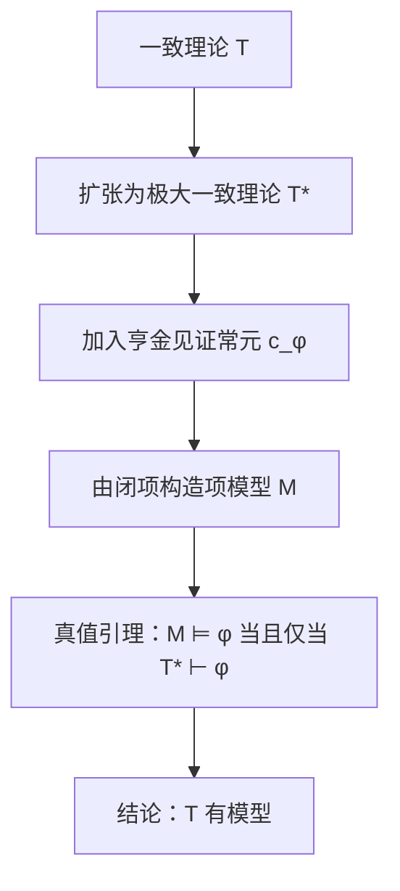

---
title: "哥德尔完备性定理"
description: "关于一阶逻辑完备性定理的笔记：亨金构造的证明思路及其推论。"
category: "数学"
subcategory: "逻辑"
tags:
  - 逻辑
  - 数理逻辑
  - 模型论
difficulty: "advanced"
created: 2025-10-03
updated: 2026-01-20
featured: true
---

# 哥德尔完备性定理

> [!IMPORTANT]
> **定理（哥德尔，1929）。** 对任意一阶理论 $T$ 与句子 $\varphi$，
> $$ T \models \varphi \iff T \vdash \varphi. $$
> 语义真与句法可证恰好重合。

正是这个定理让 [[一阶逻辑]] 成为基础研究的正确语言：两种「从……推出」的
概念——在所有模型中为真、经由形式证明可推导——描述的是完全同一个关系。

## 困难的方向

可靠性（$\vdash \,\Rightarrow\, \models$）是对证明长度的例行归纳。完备性
（$\models \,\Rightarrow\, \vdash$）才是深刻的方向。标准证明是**亨金构造**：

1. **扩张**：把 $T$ 扩张为极大一致理论 $T^*$（佐恩引理）。
2. **见证**：对每个存在公式 $\exists x\, \varphi(x)$ 引入新常元 $c_\varphi$，
   并加入公理 $\exists x\,\varphi(x) \to \varphi(c_\varphi)$。
3. **项模型**：取闭项集合按可证相等取商。
4. **真值引理**：对公式归纳证明 $\mathcal{M} \models \varphi \iff T^* \vdash \varphi$。

项模型常被称为 $T^*$ 的**典范模型**。

## 推论

- **紧致性定理**——直接推论：若 $T$ 的每个有限子集都有模型，则 $T$ 有模型。
- **勒文海姆–斯科伦定理**——亨金模型是可数的，因此每个一致的可数理论都有可数模型。
  再结合紧致性与斯科伦函数，无限模型存在于任意基数上。
- **非标准模型**——算术有无限模型，故在任意无限基数上都有模型；其中不可数的
  模型没有一个同构于 $\mathbb{N}$。

> [!WARNING]
> 完备性并不意味着*可判定性*。证明本质上非构造——见 [[哥德尔不完备定理]]，
> 当你追问「某个给定句子是否可证」时会发生什么。

## 为什么二阶逻辑失效

完备性定理依赖于这样一个事实：一阶逻辑的语义能被句法构造（项模型）所镜像。
二阶逻辑的语义谈论论域的*所有*子集，没有任何句法构造能捕捉这一点——因此
二阶逻辑没有完备的证明系统。另见 [[一阶逻辑]]，以及未完成的笔记 [[模型论]]。
